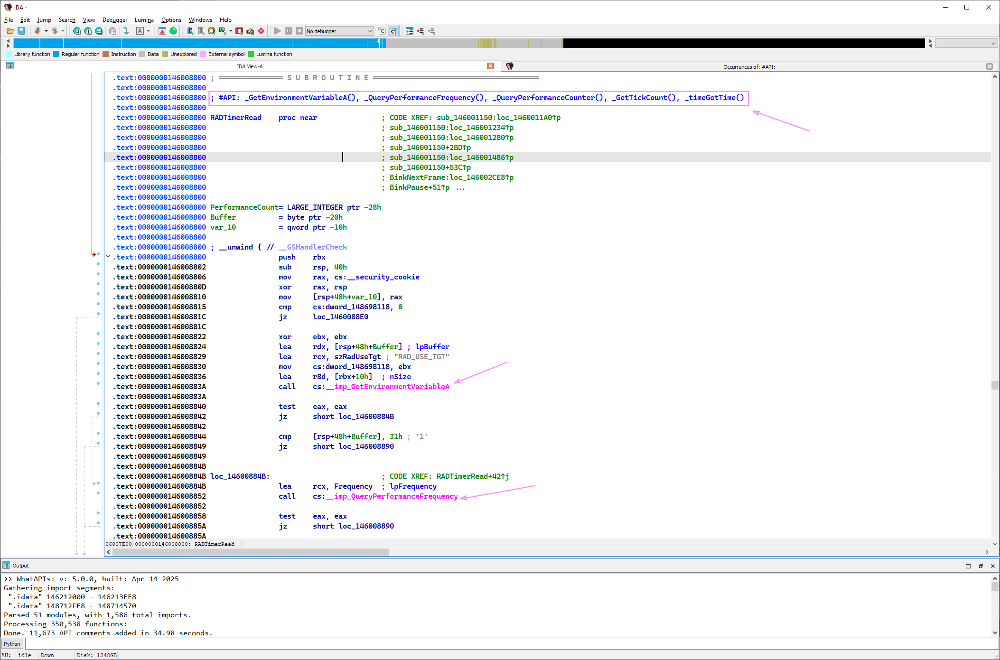

## IDA WhatAPIs Plugin

A plug-in for IDA Pro to display contextual function API usage. 
By Kevin Weatherman, Updated 2025 for IDA 9, [Github](https://github.com/kweatherman/IDA_Support)

------

### Description

The IDA WhatAPIs plug-in scans all functions in a loaded IDA database (IDB) and annotates each function with comments listing the APIs it uses.  
This provides quick, contextual information to assist with reverse engineering.

------

### Installation

1. Copy the "IDA_WhatAPIs_PlugIn.dll" file to your IDA Pro plugins directory.

2. Edit the IDA Pro "plugins.cfg" file (typically located at ..\plugins\plugins.cfg) to configure the plug-in with a hotkey.   
   For example, add the following lines:   
   `WhatAPIs IDA_WhatAPIs_PlugIn.dll Ctrl-8 0`

Refer to the IDA Pro documentation for additional details on installing and managing plug-ins.

------

### Usage

To run the plug-in:

1. Open IDA Pro and load your IDB.
2. Activate the plug-in via:
   - The assigned hotkey (e.g., Ctrl-8 if configured as above), or
   - The IDA menu: Edit -> Plugins -> IDA_WhatAPIs_PlugIn.
3. Click "Continue" in the dialog that appears to let the plug-in process the IDB.
4. Once complete, browse the function list or disassembly view to see API usage comments appended to each function.

#### Note on Multiple Plug-ins

If you use my other contextual comment plug-ins, run them in this order to avoid comment conflicts:

1. Function String Associate
2. Mark Reference Counts
3. WhatAPIs

This ensures proper comment placement, as some plug-ins prepend while others append.

------

### Design

The plug-in is simple but effective. It was created to address a practical need during reverse engineering: quickly identifying APIs used within functions. By displaying this information as function comments, it saves time and enhances understanding of the code.

APIs are significant in understanding a function's behavior, and this plug-in aims to make that information more accessible.

------

### License

**MIT License**
Copyright © 2009–present Kevin Weatherman  

Permission is hereby granted, free of charge, to any person obtaining a copy of this software and associated documentation files (the "Software"), to deal in the Software without restriction, including without limitation the rights to use, copy, modify, merge, publish, distribute, sublicense, and/or sell copies of the Software, and to permit persons to whom the Software is furnished to do so, subject to the following conditions:

The above copyright notice and this permission notice shall be included in all copies or substantial portions of the Software.

THE SOFTWARE IS PROVIDED "AS IS", WITHOUT WARRANTY OF ANY KIND, EXPRESS OR IMPLIED, INCLUDING BUT NOT LIMITED TO THE WARRANTIES OF MERCHANTABILITY, FITNESS FOR A PARTICULAR PURPOSE, AND NONINFRINGEMENT. IN NO EVENT SHALL THE AUTHORS OR COPYRIGHT HOLDERS BE LIABLE FOR ANY CLAIM, DAMAGES, OR OTHER LIABILITY, WHETHER IN AN ACTION OF CONTRACT, TORT, OR OTHERWISE, ARISING FROM, OUT OF, OR IN CONNECTION WITH THE SOFTWARE OR THE USE OR OTHER DEALINGS IN THE SOFTWARE.

See [MIT License](http://www.opensource.org/licenses/mit-license.php) for full details.

